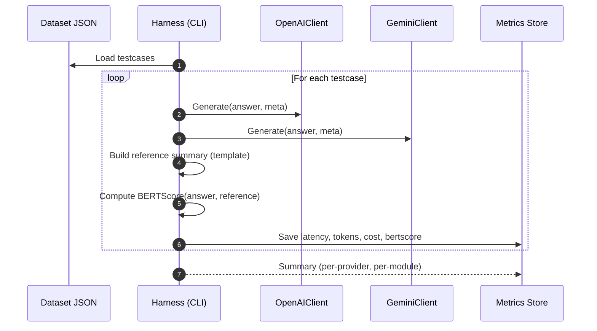

# Perbandingan Model LLM: OpenAI vs Gemini (RAG + Structured Retrieval)

Dokumen ini memaparkan rencana implementasi, alur pengujian, dan parameter yang diperlukan untuk membandingkan performa model dari API OpenAI dan Google Gemini pada chatbot Sikolbia yang menggunakan RAG dengan structured-retrieval.

Terkait arsitektur dasar chatbot, lihat: `docs/chatbot/rag-structured-retrieval.md`.

---

## 1) Tujuan Evaluasi

- Menilai kualitas jawaban berbasis data terstruktur (bukan Q&A umum) pada tiga modul: lahan, benih-pupuk, iklim-opt-dpi.
- Metrik utama:
  - Faithfulness/groundedness: klaim sesuai tabel konteks.
  - Akurasi numerik: angka yang disebut cocok dengan data.
  - Relevansi: menjawab sesuai intent & dimensi.
  - Kejelasan/struktur: mudah dibaca, ringkas, dan menyertakan satuan.
  - Efisiensi: latency, token usage, biaya estimasi.

---

## 2) Rencana Implementasi (Provider-agnostic)

### 2.1 Abstraksi klien LLM
- Buat interface `LLMClientInterface` (PHP) dengan kontrak:
  - `generate(array $messages, array $options): LLMResponse`
  - `name(): string` (mis. "openai" atau "gemini")
- Implementasi:
  - `OpenAIClient` (mengacu `config/openai.php`)
  - `GeminiClient` (config baru, mis. `config/gemini.php`)
- Registrasi melalui service container dan binding berbasis config aktif `llm.default_provider`.

### 2.2 Konfigurasi
- Tambahan `.env`:
```
# OpenAI
OPENAI_API_KEY=...
OPENAI_MODEL=gpt-4o-mini
OPENAI_BASE=https://api.openai.com/v1

# Gemini
GEMINI_API_KEY=...
GEMINI_MODEL=gemini-1.5-flash
GEMINI_BASE=https://generativelanguage.googleapis.com

# Switch provider
LLM_DEFAULT_PROVIDER=openai  # atau gemini
```
- Tambah `config/llm.php` untuk menyatukan default, timeout, dan batas token.

### 2.3 Unifikasi prompt & konteks
- Gunakan template prompt yang sama untuk kedua provider:
  - System instruction (peran, aturan ground truth, format jawaban)
  - User message: pertanyaan asli
  - Context message: ringkasan tabel/metadata (hasil `ReportService`)
- Normalisasi opsi agar adil:
  - temperature=0.2, top_p=1
  - max_tokens_output sama
  - candidate_count=1 (di Gemini)
  - Nonaktifkan tool-calling/JSON schema kecuali diuji khusus

### 2.4 Logging & Telemetri
- Simpan setiap percobaan ke tabel `llm_trials` (atau log terstruktur) berisi:
  - provider, model, options (temperature, top_p/top_k, max_tokens)
  - latency (ms), token_in, token_out, finish_reason
  - prompt hash (untuk deduplikasi) dan potongan context (hash + size)
  - output text
  - label ground-truth (jika tersedia) atau pointer dataset

### 2.5 Mode Eksperimen
- A/B: panggil kedua provider untuk 1 pertanyaan dan tampilkan hasil berdampingan (untuk tim evaluasi; non-publik).
- Batch offline: jalankan kumpulan skenario yang sudah dipin (lihat §3) dan simpan metrik otomatis.

---

## 3) Dataset & Skenario Uji

### 3.1 Sumber data
- Ambil dari `ReportService` dengan parameter terstruktur (topik/variabel/klasifikasi/periode/wilayah).
- Buat kumpulan ~50–200 skenario seimbang:
  - Modul: lahan/benih-pupuk/iklim-opt-dpi (proporsi seimbang)
  - Tingkat wilayah: nasional vs provinsi (dengan dan tanpa kabupaten)
  - Periode: tahunan saja, bulanan (non-lahan), rentang sempit vs lebar
  - Klasifikasi: nol, tunggal, multi

### 3.2 Format kasus uji (JSON)
```json
{
  "id": "bp-urea-jabar-banten-2022-2024",
  "moduleType": "benih-pupuk",
  "payload": { "topik_id": 12, "variabel_id": 103, "klasifikasi_ids": [3], "tahun_ids": [2022,2023,2024], "bulan_ids": [1,2,3], "provinsi_ids": [32,36], "kabupaten_ids": [] },
  "question": "Bagaimana tren pupuk urea di Jawa Barat dan Banten 2022–2024 (Jan–Mar)?",
  "ground": {
    "claims": [
      {"type":"numeric","selector":"sum","path":"Jawa Barat/2022/Jan","value":1234.5,"unit":"ton"},
      {"type":"trend","target":"Jawa Barat","direction":"up"}
    ]
  }
}
```
- `ground.claims` bisa diisi otomatis dari dataset yang sama (script generator) untuk angka inti.

---

## 4) Metrik Evaluasi (3 indikator saja)

Penelitian ini membatasi perbandingan ke tiga metrik inti berikut agar terukur, objektif, dan replikasi mudah dilakukan.

### 4.1 Response Time (Latency)
- Definisi: waktu dari pengiriman request ke provider hingga respons lengkap diterima (completion selesai), dalam milidetik.
- Pengukuran: gunakan high-resolution timer di sisi server sebelum/sesudah panggilan API.
- Pelaporan: median (p50), p90/p95 per provider dan per modul (lahan/benih‑pupuk/iklim).

### 4.2 Biaya per Token dan Total Biaya
- Token dihitung dari nilai yang dikembalikan API (prompt_tokens, completion_tokens). Jika tidak tersedia, estimasi via tokenizer lokal yang sesuai model.
- Harga per 1K token didefinisikan pada konfigurasi (`config/llm.php`) untuk masing‑masing provider dan model (input vs output bila berbeda).
- Rumus:
  - cost_in = prompt_tokens/1000 × price_in_per_1k
  - cost_out = completion_tokens/1000 × price_out_per_1k
  - total_cost = cost_in + cost_out
- Pelaporan: rata‑rata dan median biaya per kasus; total biaya batch.

### 4.3 Kualitas Teks via BERTScore
- Tujuan: menilai kesamaan semantik jawaban model terhadap “referensi” yang dibangun deterministik dari dataset structured‑retrieval.
- Model penilai: multilingual, mis. `xlm-roberta-large`. Library: `bert-score`.
- Referensi (gold/silver) dibangkitkan otomatis dari dataset dengan template ringkas, mis.:
  1) Pilih 1–3 fakta utama (total/mean tertimbang per wilayah/periode) dan arah tren sederhana (naik/turun/tetap) jika terdefinisi.
  2) Render ke kalimat Indonesia dengan satuan yang tepat. Contoh: “Total Urea 2022–2024 di Jawa Barat meningkat; 2024 ≈ 1.23 jt ton (↑ dari 2022: 1.10 jt ton).”
- Skor: gunakan BERTScore F1; laporkan rata‑rata dan distribusi (p50, p90).
- Catatan: BERTScore mengukur kemiripan semantik, bukan verifikasi angka. Karena referensi dihasilkan dari data yang sama, korelasi dengan ketepatan angka tetap tinggi dalam tugas ini.

---

## 5) Parameter yang Diseragamkan

| Parameter              | OpenAI                     | Gemini                         | Catatan |
|------------------------|----------------------------|--------------------------------|--------|
| model                  | `gpt-4o-mini` (contoh)     | `gemini-1.5-flash`/`pro`       | Pilih kelas serupa (quality vs cost) |
| temperature            | 0.2                        | 0.2                            | Stabilitas keluaran |
| top_p                  | 1.0                        | 1.0                            | Set tetap agar fair |
| top_k                  | —                          | 40 (default) atau tetap        | Tahan default kecuali diuji |
| max_output_tokens      | 512–1024                   | 512–1024                       | Sama di kedua sisi |
| candidate_count        | —                          | 1                              | Satu kandidat |
| presence/frequency_pen | 0                          | —                              | Nonaktif |
| safety settings        | default                    | default                        | Seragamkan set standar |
| response format        | text                       | text                           | Tanpa tool-calling |

> Catatan: jika menguji JSON-structured output, siapkan skema identik dan lakukan strict parsing di kedua provider.

---

## 6) Alur Permintaan (Inference Flow)

```mermaid
flowchart LR
  UI[Chat UI] --> Ctx[Build Context via ReportService]
  Ctx -->|messages+options| Switch{Provider?}
  Switch -->|OpenAI| OA[OpenAIClient]
  Switch -->|Gemini| GM[GeminiClient]
  OA --> Resp[LLMResponse]
  GM --> Resp
  Resp --> Log[Log (latency, tokens, cost)]
  Log --> Eval[Eval harness]
  Resp --> UI
```

---

## 7) Alur Evaluasi Batch



---

## 8) Implementasi Teknis (ringkas)

### 8.1 Paket & setup
- OpenAI: gunakan SDK resmi atau HTTP sederhana (Bearer token).
- Gemini: paket PHP `google/generative-ai` atau HTTP REST (key query param).
- Tambahkan binding di `AppServiceProvider`:
```php
$this->app->bind(LLMClientInterface::class, function() {
  $default = config('llm.default_provider');
  return $default === 'gemini' ? app(GeminiClient::class) : app(OpenAIClient::class);
});
```

### 8.2 Opsi Generate (disarankan)
```php
$options = [
  'temperature' => 0.2,
  'top_p' => 1.0,
  'max_output_tokens' => 768,
];
```

### 8.3 Struktur Logging
```json
{
  "provider": "openai",
  "model": "gpt-4o-mini",
  "latency_ms": 820,
  "prompt_tokens": 1120,
  "completion_tokens": 215,
  "cost_input": 0.00336,
  "cost_output": 0.00043,
  "cost_total": 0.00379,
  "bertscore_f1": 0.864,
  "finish_reason": "stop",
  "prompt_hash": "sha256:..."
}
```

### 8.4 BERTScore (skrip evaluasi)
- Gunakan Python agar praktis:
  - Paket: `bert-score==0.3.13`, `transformers`, `torch` (CPU cukup untuk batch kecil).
  - Skrip contoh: `scripts/eval/compute_bertscore.py` yang menerima dua file (predictions.jsonl, references.jsonl) dan mengeluarkan skor per baris + agregat.
- Model disarankan: `xlm-roberta-large` (cocok untuk Bahasa Indonesia). Gunakan batch size kecil (8–16) untuk menghindari OOM.

---

## 9) Analisis & Pelaporan
- Laporkan per modul (lahan/benih-pupuk/iklim) dan per tipe tugas (tren, perbandingan wilayah, ringkasan periode).
- Tampilkan tabel ringkas: skor faithfulness, akurasi numerik, p95 latency, tokens rata-rata, estimasi biaya.
- Sertakan contoh kualitatif: jawaban bagus vs gagal beserta konteks.

---

## 10) Reproducibility
- Simpan commit hash kode, dump konfigurasi `config('llm')`, versi model, dan snapshot dataset uji.
- Kunci opsi sampling (temperature, top_p) dan aktifkan seed jika tersedia.
- Jalankan batch 3× untuk mengecek varians; gunakan rata-rata dan deviasi standar.

---

## 11) Next Steps (opsional)
- Uji JSON-structured output untuk ekstraksi angka deterministik.
- Tambahkan guardrail: validasi angka vs context sebelum menampilkan ke user.
- Eksperimen ringkasan konteks (abstraksi kolom/deret) agar token lebih efisien.
