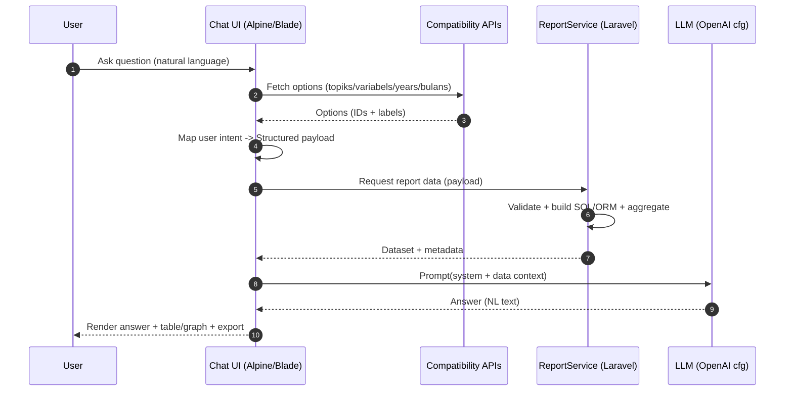

# Chatbot RAG + Structured Retrieval (Sikolbia)

Dokumen ini menjelaskan arsitektur dan alur kerja chatbot pada modul pertanian di aplikasi Sikolbia yang menerapkan RAG (Retrieval-Augmented Generation) dengan pendekatan structured-retrieval terhadap sumber data tabular resmi. Dokumentasi ini ditujukan untuk kebutuhan penelitian/skripsi dan sebagai rujukan pengembangan.

## Gambaran singkat

- Paradigma: Database-augmented RAG (bukan hanya vector search). Model bahasa tidak “mengingat” data; ia diberi konteks hasil query terstruktur dari database/layanan internal sebelum menyusun jawaban.
- Sumber data: Layanan laporan pertanian terunifikasi (lahan, benih & pupuk, iklim OptDPI) yang diekspos melalui API kompatibilitas publik dan service PHP internal.
- UI: Halaman laporan/eksplorasi yang sama dipakai untuk chatbot sebagai “structured picker” (topik, variabel, klasifikasi, waktu, wilayah). File referensi:
  - `resources/views/components/pertanian-report-page.blade.php`
  - `resources/js/components/pertanianReportForm.js`
- Service inti: `app/Services/ReportService.php` menangani validasi input, penyusunan query, agregasi/pivot, dan normalisasi label (`deskripsi`).
- Konfigurasi LLM: `config/openai.php` (gunakan kunci via env). Chatbot menyusun prompt berisi instruksi sistem + potongan data hasil retrieval terstruktur.
- Rute publik terkait: `routes/web.php` dengan prefix `pertanian` dan API kompatibilitas di `routes/api.php` (alias `api/benih-pupuk`, `api/lahan`, `api/iklim-opt-dpi`).

## Alur RAG dengan Structured Retrieval

1) Intent & parsing awal
- User mengetik pertanyaan di UI chatbot, mis. “Tampilkan pupuk urea 2022–2024 untuk Jawa Barat dan Banten”.
- NLU ringan/heuristik mengekstrak sinyal: moduleType (benih-pupuk | lahan | iklim-opt-dpi), periode (tahun/bulan), wilayah, topik/variabel, dan kandidat klasifikasi.
- UI menampilkan ringkasan deteksi (module, periode, wilayah, variabel) dan menawarkan "Gunakan hasil terstruktur ini?" untuk mempercepat alur.
- Jika ada kekosongan/ambigu, chatbot melakukan klarifikasi cepat (“pilih variabel…”, “pilih provinsi…”) menggunakan daftar dari API kompatibilitas.

2) Normalisasi dimensi melalui API kompatibilitas
- Panggilan API publik dipakai sebagai kamus/validator skema agar input user dipetakan ke ID terstruktur:
  - `GET /api/{module}/topiks`
  - `GET /api/{module}/variabels/{topikId}`
  - `GET /api/{module}/years`, `GET /api/{module}/bulans`
  - `GET /api/{module}/sample-data`, dsb.
- Hasilnya adalah payload terstruktur seperti:
```json
{
  "moduleType": "benih-pupuk",
  "topik_id": 12,
  "variabel_id": 103,
  "klasifikasi_ids": [3, 7],
  "tahun_ids": [2022, 2023, 2024],
  "bulan_ids": [1,2,3],
  "provinsi_ids": [32, 36],
  "kabupaten_ids": []
}
```

3) Structured retrieval ke sumber data tabular
- Jika modul mendukung bulanan (non‑Lahan), sebelum eksekusi kueri sistem menanyakan “Gunakan semua bulan?”; jika Ya memilih seluruh bulan, jika Tidak menampilkan checklist bulan untuk seleksi manual.
- Payload dikirim ke `ReportService` untuk menyusun query SQL/ORM yang efisien sesuai modul.
- Service menegakkan konvensi proyek:
  - Label tampilan menggunakan kolom `deskripsi`.
  - Kode komoditi: `kode_kelompok + kode_komoditi` (mis. `0101`).
  - Untuk lahan: tidak ada data bulanan; pipeline mengabaikan `bulan_ids` secara aman.
- Service mengembalikan dataset yang sudah dipivot/diringkas, beserta metadata (unit, cakupan wilayah, periode, sumber).

4) Penyusunan konteks prompt
- Chatbot membangun prompt sistem + konteks data:
  - Ringkasan tabel (header, total, rentang waktu, catatan/keterbatasan).
  - Sampel nilai/deret waktu yang relevan (dipangkas agar token efisien).
  - Instruksi format jawaban (teks ringkas, bullet insight, dan jika perlu rekomendasi visualisasi).

5) Generasi jawaban LLM
- LLM menerima prompt berisi konteks terstruktur; ini mengurangi halusinasi karena model hanya diperbolehkan menyimpulkan dari data yang disediakan.
- Output dipost-proses (penomoran, satuan, referensi sumber), lalu ditampilkan di UI.

6) Opsional: tindak lanjut & ekspor
- UI dapat menampilkan tabel/grafik (Chart.js) serta ekspor Excel (SheetJS) sesuai dataset yang sama dengan yang dikirim ke LLM.

### Kontrak “mini” (ringkas)
- Input chatbot: teks natural + (opsional) seleksi dimensi dari UI.
- Output chatbot: jawaban berbahasa alami + metadata (wilayah/periode/sumber) + opsional saran visualisasi.
- Error modes: dimensi tidak valid, periode kosong, modul tidak mendukung bulanan (lahan), kueri terlalu besar (dibatasi dan diminta refinemen).
- Sukses: jawaban mereferensikan data terkini, bebas halusinasi angka, dan selaras dengan tabel yang bisa direkonstruksi kembali oleh pengguna.

## Flow diagram (Mermaid)

```mermaid
flowchart TD
    A[User Query] --> B{Parse & Detect Intent}
    B -->|Ambigu| C[Clarify via options]
    B -->|Jelas| D[Build Structured Payload]
    C --> D
    D --> E[Validate/Normalize via API kompatibilitas]
    E --> F[ReportService: build query + pivot]
    F --> G[Structured Dataset + Metadata]
    G --> H[Compose Prompt with Data Context]
    H --> I[LLM Generation]
    I --> J[Post-process (units, refs)]
    J --> K[Chat UI Render]
    K --> L{Follow-up?}
    L -->|Yes| B
    L -->|No| M[End]
```

### Sequence diagram (end-to-end)



## Detail structured-retrieval yang digunakan

- Bukan vektor/embedding untuk teks panjang; fokus pada tabel resmi dengan skema yang ketat.
- “Retrieval” = komposisi query parameter terstruktur (dimensi, filter waktu/wilayah, klasifikasi) yang kemudian diolah `ReportService`.
- Kode/label diseragamkan agar jawaban konsisten dengan tampilan UI dan ekspor Excel.
- Untuk skenario eksplorasi bebas, chatbot meminta konfirmasi dimensi sebelum eksekusi kueri besar.

## Edge cases & strategi
- Ambiguitas variabel/klasifikasi: minta klarifikasi singkat atau default ke variabel populer.
- Modul lahan tanpa bulanan: hapus `bulan_ids`, tampilkan catatan di jawaban.
- Rentang terlalu lebar: paging atau sampling deret (mis. 12 bulan terakhir) untuk menjaga batas token LLM.
- Wilayah nested (provinsi/kabupaten): jika user memilih tingkat provinsi, chatbot otomatis memunculkan pemilihan kabupaten.
- Pilihan bulan (all vs specific): default ke "semua bulan" untuk ringkas; tawarkan checklist bila user ingin memfilter bulan tertentu.
- Satuan/konversi: selalu tampilkan `satuan` dari variabel; hindari aritmetika jika tidak ada dasar.

## Contoh prompt (ringkas)

```
System: Anda adalah asisten data pertanian. Jawablah hanya berdasarkan data yang disediakan. Jika tidak ada data, katakan tidak tersedia.
Context:
- Module: benih-pupuk; Variabel: Urea (ton)
- Wilayah: Jawa Barat, Banten
- Periode: 2022–2024 (Jan–Mar)
- Tabel ringkas: [..baris agregat terpotong..]
Task: Buat ringkasan 3 poin dan soroti tren penting.
```

## Implementasi terkait di repo
- UI/Blade: `resources/views/components/pertanian-report-page.blade.php`
- JS helper: `resources/js/components/pertanianReportForm.js`
- Service: `app/Services/ReportService.php`
- Routes: `routes/web.php` (prefix `pertanian`), `routes/api.php` (`api/benih-pupuk`, `api/lahan`, `api/iklim-opt-dpi`)
- Konfigurasi LLM: `config/openai.php`

## Cara mencoba (lokal/dev)
1. Pastikan aplikasi berjalan dan seed dasar sudah masuk.
2. Buka halaman pertanian/report, pilih module dan dimensi; lalu ajukan pertanyaan di chatbot tentang data yang sama.
3. Bandingkan jawaban chatbot dengan tabel/plot yang muncul. Nilai konsistensi dan kebebasan halusinasi.

## Catatan penelitian
- Metode ini cocok untuk domain dengan skema data baku dan kebutuhan auditabilitas (jawaban dapat dilacak ke tabel sumber).
- Kinerja jawaban sangat dipengaruhi seleksi konteks (ringkasan yang tepat, bukan menyalin seluruh tabel).
- Dapat dipadukan dengan vector store untuk dokumen naratif, tetapi untuk tabel numeric terstruktur, pendekatan ini lebih deterministik.
