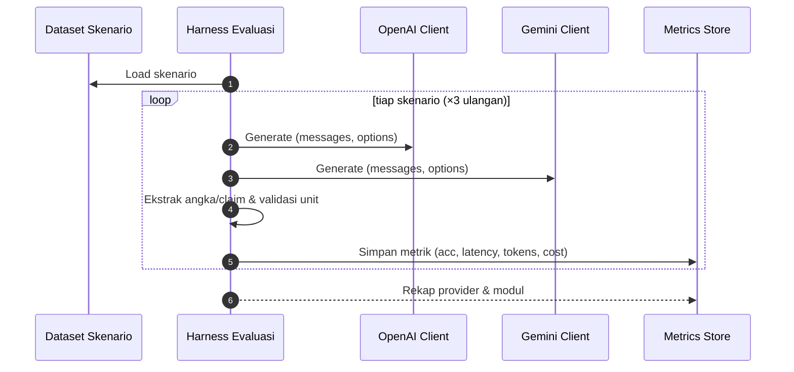

# Rencana Penelitian: Chatbot LLM dengan RAG (Structured Retrieval) dan Perbandingan Model OpenAI vs Google Gemini

Dokumen ini merangkum rencana penelitian dari perancangan hingga pengujian dan analisis perbandingan kinerja dua penyedia model LLM (OpenAI dan Google Gemini) pada chatbot Sikolbia yang menggunakan metode Retrieval-Augmented Generation (RAG) dengan pendekatan structured-retrieval terhadap data tabular pertanian.

Referensi terkait arsitektur dan rencana perbandingan teknis:
- RAG + structured-retrieval: `docs/chatbot/rag-structured-retrieval.md`
- Rencana perbandingan LLM (flow, metrik, parameter): `docs/chatbot/llm-comparison-plan.md`

---

## 1. Latar Belakang & Tujuan

- Latar belakang: Kebutuhan layanan tanya-jawab berbasis data resmi pertanian yang menjamin akuntabilitas dan mengurangi halusinasi.
- Tujuan umum: Merancang chatbot LLM yang menjawab berdasarkan data terstruktur (bukan hanya pengetahuan model) dan membandingkan kinerja dua keluarga model (OpenAI GPT vs Google Gemini) di atas pipeline yang sama.
- Tujuan khusus:
  1) Mendesain RAG dengan structured-retrieval yang konsisten dengan UI laporan pertanian (topik, variabel, klasifikasi, waktu, wilayah).
  2) Mengimplementasikan abstraksi penyedia LLM yang dapat diganti (provider-agnostic) tanpa mengubah bisnis proses.
  3) Melakukan evaluasi kuantitatif dan kualitatif terhadap kualitas jawaban, efisiensi, dan biaya.

---

## 2. Pertanyaan Penelitian & Hipotesis

- RQ1: Apakah RAG berbasis structured-retrieval menghasilkan jawaban yang lebih faithful terhadap data dibandingkan generasi tanpa konteks?
  - H1: Dengan konteks terstruktur, tingkat kesesuaian klaim terhadap data (faithfulness) ≥ 0.9.
- RQ2: Bagaimana perbandingan kualitas jawaban OpenAI vs Gemini pada tugas-tugas berbasis data tabular pertanian?
  - H2: Perbedaan rata-rata skor faithfulness dan akurasi numerik antar penyedia signifikan secara statistik (α = 0.05).
- RQ3: Bagaimana perbandingan efisiensi (latency, token, biaya) OpenAI vs Gemini pada skenario yang sama?
  - H3: Salah satu penyedia memiliki latency p95 yang lebih rendah secara konsisten di ≥ 2 dari 3 modul (lahan, benih-pupuk, iklim).

---

## 3. Ruang Lingkup & Asumsi

- Data: Tabel resmi modul lahan, benih-pupuk, iklim OptDPI tersedia via service internal dan API kompatibilitas.
- Fokus: Jawaban berbasis tabel dan ringkasan tren; bukan QA dokumen naratif panjang.
- Asumsi: Skema data stabil; UI dan `ReportService` menyajikan metadata dan ringkasan yang konsisten.

---

## 4. Arsitektur Sistem Singkat

- UI/Blade: `resources/views/components/pertanian-report-page.blade.php` (pemilih dimensi dan tampilan hasil/grafik/ekspor)
- Service pengambilan data: `app/Services/ReportService.php` (validasi, query, pivot, normalisasi label `deskripsi`)
- Rute publik: `routes/web.php` (prefix `pertanian`), API kompatibilitas di `routes/api.php`
- Konfigurasi LLM: `config/openai.php` (dan akan ditambah `config/gemini.php`/`config/llm.php`)

### Diagram alur sistem (ringkas)
```mermaid
flowchart TD
  U[User] --> UI[Chat UI]
  UI --> SR[Structured Retrieval (ReportService)]
  SR --> Ctx[Context (dataset+metadata)]
  Ctx --> SW{Provider Switch}
  SW --> OA[OpenAI Client]
  SW --> GM[Gemini Client]
  OA --> Ans[Jawaban]
  GM --> Ans
  Ans --> Log[Logging & Metrics]
  Ans --> UI
```

---

## 5. Desain Metode: RAG dengan Structured Retrieval

- Parsing intent → normalisasi dimensi melalui API kompatibilitas → komposisi payload terstruktur → query/pivot melalui `ReportService` → ringkasan konteks → prompt ke LLM.
- Konteks diringkas (header, ringkasan angka, rentang waktu, catatan satuan) untuk efisiensi token.
- Perlakuan khusus modul:
  - Lahan: tanpa bulanan; pipeline menghapus `bulan_ids` dan menandai di jawaban.
  - Komoditi: gunakan kode `kode_kelompok + kode_komoditi` untuk koherensi dengan AJAX/route.

---

## 6. Desain Komponen Perbandingan LLM

- Interface `LLMClientInterface` dengan metode `generate(messages, options)` dan `name()`.
- Implementasi: `OpenAIClient`, `GeminiClient`; binding via `LLM_DEFAULT_PROVIDER` di `.env`.
- Unifikasi prompt (system + user + context) dan penyetaraan parameter (temperature, top_p/top_k, max_output_tokens).
- Logging `llm_trials`: provider, model, opsi, latency, token, biaya estimasi, hash prompt/konteks, dan keluaran.

---

## 7. Dataset & Skenario Uji

- Sumber skenario: kombinasi dimensi dari modul-modul (lahan/benih-pupuk/iklim) dengan variasi wilayah (nasional vs provinsi/kabupaten), periode (tahunan vs bulanan), dan klasifikasi (0/1/multi).
- Target ukuran: 50–200 skenario seimbang antar modul.
- Format kasus uji dan generator ground-truth numerik: lihat contoh di `llm-comparison-plan.md`.

---

## 8. Protokol Eksperimen

- Desain: within-subjects A/B (kedua provider menerima pertanyaan dan konteks yang sama).
- Randomisasi urutan panggilan (mengurangi bias posisi).
- Repetisi: jalankan 3× per kasus untuk mengukur varians sampling; bekukan opsi sampling (temperature/top_p).
- Kontrol: konteks yang sama (hash diverifikasi), token limit sama, satu kandidat output.
- Output: simpan teks lengkap, token, latency, finish reason, dan metadata lainnya.

### Diagram alur eksperimen (batch)


---

## 9. Metrik & Penilaian (dibatasi 3 indikator)

- Response Time (Latency): waktu server‑side dari request sampai respons selesai; laporkan p50/p90/p95 per provider dan per modul.
- Biaya per Token & Total Biaya: hitung dari prompt_tokens dan completion_tokens dengan harga per 1K token pada konfigurasi model/providernya.
- Kualitas Teks via BERTScore: gunakan BERTScore F1 (model `xlm-roberta-large`) terhadap referensi ringkas yang dibangkitkan deterministik dari dataset terstruktur.

---

## 10. Analisis Statistik

- Bandingkan berpasangan OpenAI vs Gemini per kasus untuk ketiga metrik: gunakan paired t‑test atau Wilcoxon signed‑rank (non‑normal).
- Laporkan effect size (Cohen’s d) dan CI 95% (bootstrap) untuk rata‑rata selisih metrik.
- Karena metrik dibatasi 3, koreksi multi‑perbandingan ringan (Holm–Bonferroni) masih dapat diterapkan bila diperlukan.

---

## 11. Parameter yang Diseragamkan (Ringkas)

- Model: `gpt-4o-mini` vs `gemini-1.5-flash/pro` (kelas serupa).
- Sampling: temperature 0.2, top_p 1.0; Gemini top_k default (atau dikunci 40).
- Panjang keluaran: max_output_tokens 512–1024 (identik di kedua sisi).
- candidate_count: 1; tool-calling/JSON schema dinonaktifkan kecuali uji khusus.

Detail tabel parameter ada di `llm-comparison-plan.md`.

---

## 12. Timeline (contoh 4–6 minggu)

1) Minggu 1: Abstraksi klien LLM, config, dan logging.
2) Minggu 2: Generator skenario + harness batch, metrik otomatis dasar.
3) Minggu 3: Evaluasi awal, perbaikan prompt/konteks, stabilisasi parameter.
4) Minggu 4: Human rating + LLM-as-a-judge (opsional), analisis statistik.
5) Minggu 5–6: Penulisan laporan dan replikasi hasil.

---

## 13. Kriteria Keberhasilan

- Pipeline RAG terotomasi dan reproducible; log lengkap untuk semua percobaan.
- ≥ 90% skenario menghasilkan jawaban yang dapat diverifikasi (tanpa error fatal).
- Laporan perbandingan berisi skor, tabel rekap, diagram, dan contoh kualitatif.

---

## 14. Reproducibility

- Simpan commit hash, versi model, dump `config('llm')`, dan snapshot dataset uji.
- Seed sampling (bila tersedia); jalankan batch minimal 3×.
- Arsipkan hasil mentah (JSON/CSV) dan notebook/grafik analisis.

---

## 15. Risiko & Mitigasi

- Perubahan API/versi model: kunci versi model dan dokumentasikan tanggal uji.
- Batas token/biaya: ringkas konteks dan batasi batch; pantau token usage.
- Varians output: ulangan 3×, gunakan CI/SE untuk pelaporan.

---

## 16. Artefak yang Akan Ditambahkan (Implementasi)

- `config/llm.php`, `config/gemini.php`
- `app/Services/LLM/LLMClientInterface.php`, `OpenAIClient.php`, `GeminiClient.php`
- Tabel/log `llm_trials` + artisan command `llm:eval-batch` (harness offline)
- Skrip generator skenario + evaluator metrik (angka/unit/groundedness)

Dengan rencana ini, penelitian dapat dilakukan end-to-end dari desain, implementasi, pengujian batch, hingga analisis perbandingan yang transparan dan dapat direplikasi.
