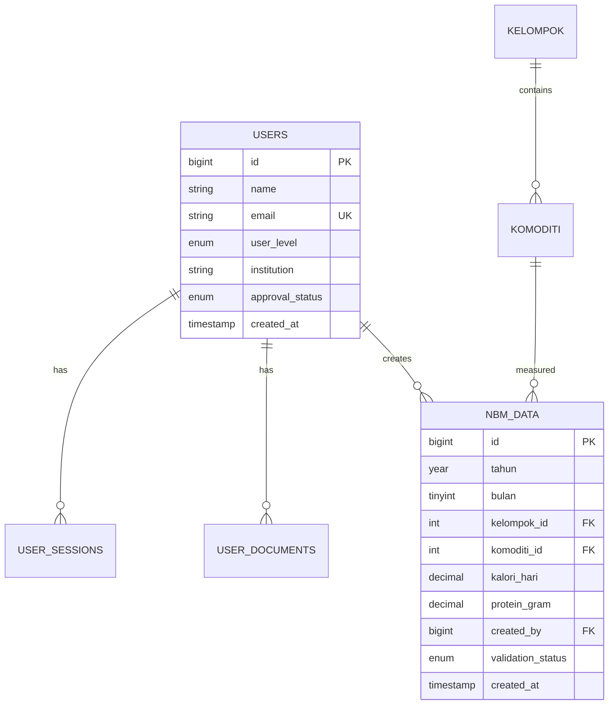

# Software Requirements Specification (SRS)
## Sistem Informasi Konsumsi Lahan Bibit Iklim dan Alamat - Modul Konsumsi Pangan

### Dokumen Informasi
- **Project Name**: SIKOLBIA - Modul Konsumsi Pangan (NBM) v2.0
- **Document Type**: Software Requirements Specification
- **Version**: 2.0
- **Date**: Oktober 2025
- **Status**: Draft untuk Redesign
- **Timeline**: 3 bulan pengembangan

---

## 1. Introduction

### 1.1 Purpose
Dokumen SRS ini menjelaskan spesifikasi perangkat lunak untuk modul konsumsi pangan dari Sistem Informasi Konsumsi Lahan Bibit Iklim dan Alamat (SIKOLBIA), yang merupakan sistem khusus untuk:
- Pengelolaan data NBM (Neraca Bahan Makanan)
- Prediksi konsumsi pangan menggunakan AI
- Analisis kalori 120 komoditas dalam 11 kelompok
- User access management bertingkat untuk modul konsumsi pangan

### 1.2 Scope
Modul Konsumsi Pangan SIKOLBIA adalah web application berbasis Laravel dan FastAPI yang menyediakan:
- **Core System**: Data management NBM, user management, reporting konsumsi pangan
- **AI Engine**: ML prediction konsumsi kalori, SHAP analysis, model monitoring  
- **Public Interface**: Landing page NBM, public APIs, documentation
- **Admin Interface**: System configuration, user approval, NBM data management

### 1.3 Definitions and Acronyms
- **SRS**: Software Requirements Specification
- **SIKOLBIA**: Sistem Informasi Konsumsi Lahan Bibit Iklim dan Alamat
- **NBM**: Neraca Bahan Makanan (fokus utama modul ini)
- **RBAC**: Role-Based Access Control
- **JWT**: JSON Web Token
- **API**: Application Programming Interface
- **ML**: Machine Learning
- **SHAP**: SHapley Additive exPlanations
- **Komoditas**: 120 jenis bahan pangan dalam 11 kelompok
- **Kalori**: Satuan energi konsumsi pangan (fokus gizi utama)

---

## 2. System Overview

### 2.1 System Architecture

```
┌─────────────────┐    ┌─────────────────┐    ┌─────────────────┐
│   Frontend NBM  │    │   Backend       │    │   AI Engine     │
│                 │    │                 │    │                 │
│ - Public Web    │◄──►│ - Laravel API   │◄──►│ - FastAPI       │
│ - Admin Panel   │    │ - Authentication│    │ - NBM ML Models │
│ - User Dashboard│    │ - Authorization │    │ - SHAP Analysis │
│ - NBM Analytics │    │ - NBM Data Layer│    │ - Monitoring    │
└─────────────────┘    └─────────────────┘    └─────────────────┘
         │                       │                       │
         └───────────────────────┼───────────────────────┘
                                 │
                    ┌─────────────────┐
                    │   Database      │
                    │                 │
                    │ - MySQL/Postgres│
                    │ - Redis Cache   │
                    │ - File Storage  │
                    └─────────────────┘
```

### 2.2 Technology Stack

#### 2.2.1 **Frontend Technologies**
- **Framework**: Laravel Blade + Alpine.js
- **CSS Framework**: Tailwind CSS
- **Charts**: Chart.js (untuk visualisasi NBM)
- **Icons**: FontAwesome
- **Build Tool**: Vite
- **Language**: Bahasa Indonesia

#### 2.2.2 **Backend Technologies**
- **Main Framework**: Laravel 12
- **API Framework**: FastAPI (Python) untuk ML
- **Authentication**: Laravel Sanctum
- **Email**: Layanan email gratis (tidak ditentukan)
- **File Storage**: Local storage

#### 2.2.3 **Database Technologies**
- **Primary Database**: MySQL 8.0 (via Docker)
- **Cache**: Redis 7.0 (via Docker)
- **File Storage**: Local filesystem
- **Backup**: Local backup strategy

#### 2.2.4 **AI/ML Technologies untuk NBM**
- **ML Framework**: scikit-learn, XGBoost
- **Explainable AI**: SHAP untuk interpretabilitas NBM
- **Data Processing**: Pandas, NumPy
- **Monitoring**: Tools monitoring gratis (belum ditentukan)
- **Model Focus**: Prediksi konsumsi kalori 120 komoditas

### 2.3 Deployment Architecture (Local Production with Nginx)

```
                    ┌─────────────────┐
                    │     Nginx       │
                    │ localhost:8000  │
                    │ (Web Server)    │
                    └─────────┬───────┘
                              │
                    ┌─────────▼───────┐
                    │   Docker Stack  │
                    │   (Laravel App) │
                    └─────────┬───────┘
                              │
              ┌───────────────┼───────────────┐
              │               │               │
    ┌─────────▼───────┐ ┌────▼────┐ ┌────────▼────────┐
    │  FastAPI NBM    │ │ MySQL   │ │  Local Storage  │
    │  localhost:8082 │ │ :3306   │ │  (File System)  │
    └─────────────────┘ └─────────┘ └─────────────────┘
```

**Akses Sistem**: Web browser → Nginx → Laravel App (tidak ada mobile apps)

---

## 3. Functional Requirements

### 3.1 Authentication and Authorization System

#### 3.1.1 **FR-001: Multi-Level User Management NBM**
**Description**: Sistem pengelolaan user dengan 4 level akses untuk modul konsumsi pangan
**Priority**: Critical
**URLs**: 
- Admin: `/admin/konsumsi-pangan/`
- Pemerintah: `/ketersediaan/pemerintah/`
- Akademisi: `/ketersediaan/akademisi/`
- Publik: `/ketersediaan/`

**Specifications**:
- **Level 1 (Admin)**: Full system access
  - User management (CRUD operations)
  - NBM data management
  - AI model management untuk prediksi konsumsi
  - System configuration

- **Level 2 (Pemerintah)**: High-level data access NBM
  - Advanced analytics dashboard konsumsi pangan
  - Full NBM data export capabilities
  - Policy-focused reports
  - Akses lengkap 120 komoditas dan analisis SHAP

- **Level 3 (Akademisi)**: Research-focused access NBM
  - Historical NBM data access (1993-2024)
  - Statistical analysis tools untuk konsumsi pangan
  - Limited data export
  - Research collaboration features

- **Level 4 (Publik)**: Basic information access NBM
  - Public dashboard konsumsi pangan
  - Basic statistics NBM
  - Public reports
  - No registration required

#### 3.1.2 **FR-002: Registration Workflow System**
**Description**: Automated registration dan approval workflow

**Government Registration Workflow**:
```php
class GovernmentRegistrationWorkflow {
    public function processRegistration(RegistrationRequest $request) {
        // 1. Validate institutional email
        // 2. Document verification
        // 3. Admin notification
        // 4. Approval/rejection process
        // 5. Account activation
    }
}
```

**Academic Registration Workflow**:
```php
class AcademicRegistrationWorkflow {
    public function processRegistration(RegistrationRequest $request) {
        // 1. Validate academic credentials
        // 2. Research proposal review
        // 3. Limited access approval
        // 4. Account activation with restrictions
    }
}
```

### 3.2 Data Management System

#### 3.2.1 **FR-003: Centralized Data Input System**
**Description**: Sistem input data terpusat dengan validation

**Database Schema Design**:
```sql
-- Core NBM Data Table
CREATE TABLE nbm_data (
    id BIGINT PRIMARY KEY AUTO_INCREMENT,
    tahun YEAR NOT NULL,
    bulan TINYINT NOT NULL,
    kelompok_id INT NOT NULL,
    komoditi_id INT NOT NULL,
    kalori_hari DECIMAL(10,2) NOT NULL,
    protein_gram DECIMAL(8,2),
    lemak_gram DECIMAL(8,2),
    created_by BIGINT NOT NULL,
    validated_by BIGINT NULL,
    validation_status ENUM('pending', 'approved', 'rejected') DEFAULT 'pending',
    created_at TIMESTAMP DEFAULT CURRENT_TIMESTAMP,
    updated_at TIMESTAMP DEFAULT CURRENT_TIMESTAMP ON UPDATE CURRENT_TIMESTAMP,
    
    INDEX idx_time (tahun, bulan),
    INDEX idx_commodity (kelompok_id, komoditi_id),
    INDEX idx_validation (validation_status),
    FOREIGN KEY (created_by) REFERENCES users(id),
    FOREIGN KEY (validated_by) REFERENCES users(id)
);

-- User Management Tables
CREATE TABLE users (
    id BIGINT PRIMARY KEY AUTO_INCREMENT,
    name VARCHAR(255) NOT NULL,
    email VARCHAR(255) UNIQUE NOT NULL,
    email_verified_at TIMESTAMP NULL,
    password VARCHAR(255) NOT NULL,
    user_level ENUM('admin', 'government', 'academic', 'public') NOT NULL,
    institution VARCHAR(255) NULL,
    position VARCHAR(255) NULL,
    research_interest TEXT NULL,
    approval_status ENUM('pending', 'approved', 'rejected') DEFAULT 'pending',
    approved_by BIGINT NULL,
    approved_at TIMESTAMP NULL,
    last_login_at TIMESTAMP NULL,
    created_at TIMESTAMP DEFAULT CURRENT_TIMESTAMP,
    updated_at TIMESTAMP DEFAULT CURRENT_TIMESTAMP ON UPDATE CURRENT_TIMESTAMP,
    
    INDEX idx_level (user_level),
    INDEX idx_approval (approval_status),
    FOREIGN KEY (approved_by) REFERENCES users(id)
);

-- User Registration Documents
CREATE TABLE user_documents (
    id BIGINT PRIMARY KEY AUTO_INCREMENT,
    user_id BIGINT NOT NULL,
    document_type ENUM('institutional_letter', 'research_proposal', 'identity', 'other'),
    file_path VARCHAR(500) NOT NULL,
    original_name VARCHAR(255) NOT NULL,
    file_size BIGINT NOT NULL,
    mime_type VARCHAR(100) NOT NULL,
    verified_by BIGINT NULL,
    verified_at TIMESTAMP NULL,
    created_at TIMESTAMP DEFAULT CURRENT_TIMESTAMP,
    
    FOREIGN KEY (user_id) REFERENCES users(id) ON DELETE CASCADE,
    FOREIGN KEY (verified_by) REFERENCES users(id)
);
```

#### 3.2.2 **FR-004: Data Validation System**
**Description**: Multi-layer data validation

```php
class DataValidationService {
    public function validateNBMData(array $data): ValidationResult {
        // 1. Format validation
        $formatValidation = $this->validateFormat($data);
        
        // 2. Business rule validation
        $businessValidation = $this->validateBusinessRules($data);
        
        // 3. Historical consistency check
        $consistencyValidation = $this->validateConsistency($data);
        
        // 4. Statistical outlier detection
        $outlierValidation = $this->detectOutliers($data);
        
        return new ValidationResult([
            'format' => $formatValidation,
            'business' => $businessValidation,
            'consistency' => $consistencyValidation,
            'outliers' => $outlierValidation
        ]);
    }
}
```

### 3.3 AI/ML Integration System

#### 3.3.1 **FR-005: NBM Prediction Engine**
**Description**: AI engine untuk prediksi NBM dengan explainable AI

**FastAPI Structure**:
```python
# ml_service/main.py
from fastapi import FastAPI, Depends, HTTPException
from .models import NBMPredictor, SHAPAnalyzer
from .auth import verify_api_key
from .monitoring import ModelMonitor

app = FastAPI(title="SIKOLBIA ML API", version="2.0")

class MLService:
    def __init__(self):
        self.predictor = NBMPredictor()
        self.shap_analyzer = SHAPAnalyzer()
        self.monitor = ModelMonitor()
    
    async def predict_nbm(
        self, 
        prediction_request: PredictionRequest,
        user_level: str = Depends(verify_api_key)
    ):
        # 1. Validate input data
        # 2. Generate prediction with confidence intervals
        # 3. Perform SHAP analysis (if user_level allows)
        # 4. Log prediction for monitoring
        # 5. Return structured response
        
    async def get_model_insights(
        self,
        user_level: str = Depends(verify_api_key)
    ):
        # 1. Check user authorization
        # 2. Generate global SHAP analysis
        # 3. Return feature importance insights
```

#### 3.3.2 **FR-006: Model Monitoring System**
**Description**: Real-time monitoring untuk ML model performance

```python
class ModelMonitor:
    def __init__(self):
        self.redis_client = redis.Redis()
        self.metrics_storage = MetricsStorage()
    
    def log_prediction(self, prediction_data: dict):
        # 1. Store prediction metrics
        # 2. Update performance statistics
        # 3. Check for model drift
        # 4. Trigger alerts if needed
    
    def calculate_drift_metrics(self) -> DriftMetrics:
        # 1. Statistical drift detection
        # 2. Performance degradation check
        # 3. Data distribution changes
        return DriftMetrics(...)
```

### 3.4 User Interface System

#### 3.4.1 **FR-007: Public Landing Interface**
**Description**: Public-facing website dengan informasi interaktif

**Page Structure**:
```
/                           # Landing page dengan overview
├── /statistik             # Public statistics dashboard
├── /laporan              # Public reports download
├── /metodologi           # AI methodology explanation
├── /dokumentasi          # API documentation
├── /registrasi           # Registration forms
└── /kontak              # Contact information
```

**Laravel Route Structure**:
```php
// Public routes (no authentication)
Route::group(['prefix' => '/', 'middleware' => ['web']], function () {
    Route::get('/', [PublicController::class, 'landing'])->name('home');
    Route::get('/statistik', [PublicController::class, 'statistics'])->name('public.statistics');
    Route::get('/laporan', [PublicController::class, 'reports'])->name('public.reports');
    Route::get('/metodologi', [PublicController::class, 'methodology'])->name('public.methodology');
    Route::get('/dokumentasi', [PublicController::class, 'documentation'])->name('public.docs');
});

// Registration routes
Route::group(['prefix' => '/registrasi'], function () {
    Route::get('/pemerintah', [RegistrationController::class, 'government'])->name('register.government');
    Route::get('/akademisi', [RegistrationController::class, 'academic'])->name('register.academic');
    Route::post('/pemerintah', [RegistrationController::class, 'processGovernment']);
    Route::post('/akademisi', [RegistrationController::class, 'processAcademic']);
});
```

#### 3.4.2 **FR-008: Authenticated User Dashboards**
**Description**: Role-specific dashboards dengan appropriate access

**Dashboard Routes**:
```php
// Protected routes with role-based access
Route::group(['middleware' => ['auth', 'verified']], function () {
    
    // Admin routes
    Route::group(['prefix' => '/admin', 'middleware' => ['role:admin']], function () {
        Route::get('/dashboard', [AdminController::class, 'dashboard'])->name('admin.dashboard');
        Route::resource('users', AdminUserController::class);
        Route::resource('data', AdminDataController::class);
        Route::get('/ml-management', [AdminMLController::class, 'index'])->name('admin.ml');
    });
    
    // Government user routes  
    Route::group(['prefix' => '/government', 'middleware' => ['role:government']], function () {
        Route::get('/dashboard', [GovernmentController::class, 'dashboard'])->name('government.dashboard');
        Route::get('/analytics', [GovernmentController::class, 'analytics'])->name('government.analytics');
        Route::get('/predictions', [GovernmentController::class, 'predictions'])->name('government.predictions');
        Route::post('/export', [GovernmentController::class, 'export'])->name('government.export');
    });
    
    // Academic user routes
    Route::group(['prefix' => '/research', 'middleware' => ['role:academic']], function () {
        Route::get('/dashboard', [AcademicController::class, 'dashboard'])->name('academic.dashboard');
        Route::get('/historical-data', [AcademicController::class, 'historicalData'])->name('academic.historical');
        Route::get('/analysis-tools', [AcademicController::class, 'analysisTools'])->name('academic.tools');
        Route::post('/export-research', [AcademicController::class, 'exportForResearch'])->name('academic.export');
    });
});
```

### 3.5 API System

#### 3.5.1 **FR-009: Public API**
**Description**: Open API untuk akses data publik

```php
// API Routes
Route::group(['prefix' => 'api/v1'], function () {
    
    // Public API (no authentication)
    Route::group(['prefix' => 'public'], function () {
        Route::get('/statistics/summary', [PublicApiController::class, 'summary']);
        Route::get('/statistics/{commodity}', [PublicApiController::class, 'commodityStats']);
        Route::get('/reports/latest', [PublicApiController::class, 'latestReports']);
    });
    
    // Authenticated API
    Route::group(['middleware' => ['auth:sanctum']], function () {
        Route::get('/predictions', [ApiController::class, 'predictions']);
        Route::post('/predictions/custom', [ApiController::class, 'customPrediction']);
        Route::get('/data/export', [ApiController::class, 'exportData']);
        
        // ML API proxy
        Route::group(['prefix' => 'ml'], function () {
            Route::post('/predict', [MLApiController::class, 'predict']);
            Route::get('/model/status', [MLApiController::class, 'modelStatus']);
            Route::get('/shap/analysis', [MLApiController::class, 'shapAnalysis']);
        });
    });
});
```

#### 3.5.2 **FR-010: API Rate Limiting**
**Description**: Rate limiting berdasarkan user level

```php
class ApiRateLimiter {
    public function configureRateLimit(Request $request) {
        $user = $request->user();
        
        switch ($user->user_level) {
            case 'admin':
                return RateLimiter::for('admin-api', function () {
                    return Limit::perMinute(1000);
                });
                
            case 'government':
                return RateLimiter::for('government-api', function () {
                    return Limit::perMinute(500);
                });
                
            case 'academic':
                return RateLimiter::for('academic-api', function () {
                    return Limit::perMinute(200);
                });
                
            default:
                return RateLimiter::for('public-api', function () {
                    return Limit::perMinute(60);
                });
        }
    }
}
```

---

## 4. Non-Functional Requirements

### 4.1 Performance Requirements

#### 4.1.1 **NFR-001: Response Time Specifications**
- **Public Pages**: < 1.5 seconds (95th percentile)
- **Authenticated Pages**: < 2.5 seconds (95th percentile)
- **API Responses**: < 1 second (95th percentile)
- **ML Predictions**: < 8 seconds (single prediction)
- **Bulk Operations**: < 2 minutes (1000 records)

#### 4.1.2 **NFR-002: Scalability Requirements**
- **Concurrent Users**: 200 authenticated + 1000 public users
- **Database Size**: 50GB initial, 20GB annual growth
- **API Throughput**: 10,000 requests/hour peak
- **File Storage**: 10GB documents, 5GB annual growth

#### 4.1.3 **NFR-003: Resource Utilization**
- **CPU**: < 80% average, < 95% peak
- **Memory**: < 70% average, < 90% peak
- **Disk I/O**: < 80% average utilization
- **Network**: < 70% bandwidth utilization

### 4.2 Security Requirements

#### 4.2.1 **NFR-004: Authentication Security**
- **Password Policy**: Minimum 8 characters, complexity requirements
- **Session Management**: 24-hour timeout, secure cookies
- **Multi-Factor Authentication**: Optional for admin users
- **Account Lockout**: 5 failed attempts, 15-minute lockout

#### 4.2.2 **NFR-005: Data Security**
- **Encryption at Rest**: AES-256 for sensitive data
- **Encryption in Transit**: TLS 1.3 for all communications
- **Database Security**: Encrypted connections, restricted access
- **File Upload Security**: Virus scanning, type validation

#### 4.2.3 **NFR-006: API Security**
- **Authentication**: Bearer token (JWT)
- **Rate Limiting**: User-level rate limiting
- **Input Validation**: Strict validation for all inputs
- **SQL Injection Prevention**: Prepared statements, ORM usage

### 4.3 Reliability Requirements

#### 4.3.1 **NFR-007: System Availability**
- **Uptime**: 99.5% availability (43.8 hours downtime/year)
- **Planned Maintenance**: Monthly 2-hour windows
- **Disaster Recovery**: RTO 4 hours, RPO 1 hour
- **Backup Strategy**: Daily automated backups, 30-day retention

#### 4.3.2 **NFR-008: Error Handling**
- **Graceful Degradation**: Fallback for ML service failures
- **Error Logging**: Comprehensive logging for all errors
- **User Feedback**: Clear error messages for users
- **Monitoring**: Real-time alerting for system issues

### 4.4 Usability Requirements

#### 4.4.1 **NFR-009: User Experience**
- **Web Responsive Design**: Support for desktop dan laptop (tidak ada mobile apps)
- **Browser Support**: Chrome, Firefox, Safari, Edge (latest 2 versions)
- **Loading Indicators**: Visual feedback for long operations
- **Help System**: Context-sensitive help and documentation
- **Access Method**: Nginx localhost (web browser only)

#### 4.4.2 **NFR-010: Accessibility**
- **WCAG 2.1 AA Compliance**: Accessibility standards compliance
- **Keyboard Navigation**: Full keyboard accessibility
- **Screen Reader Support**: Compatible with screen readers
- **Color Contrast**: Sufficient contrast ratios

---

## 5. System Integration

### 5.1 External System Integration

#### 5.1.1 **Integration with Government Systems**
```php
class GovernmentSystemIntegration {
    // Integration dengan SATU DATA Indonesia
    public function syncWithSatuData(): bool {
        // 1. Authenticate with SATU DATA API
        // 2. Push summarized data
        // 3. Handle synchronization errors
    }
    
    // Integration dengan BPS
    public function fetchBPSData(): array {
        // 1. Connect to BPS API
        // 2. Fetch latest statistics
        // 3. Validate and transform data
    }
    
    // Integration dengan e-Government systems
    public function pushToEGov(array $data): bool {
        // 1. Format data for e-Gov
        // 2. Send via secure channel
        // 3. Log transaction
    }
}
```

#### 5.1.2 **Third-Party Service Integration**
- **Email Service**: AWS SES untuk notifikasi
- **File Storage**: AWS S3 atau local storage
- **Monitoring**: Prometheus + Grafana
- **Analytics**: Custom analytics dashboard
- **Notification**: SMS gateway untuk alert penting

### 5.2 Internal System Integration

#### 5.2.1 **Laravel ↔ FastAPI Communication**
```php
class MLServiceClient {
    private $baseUrl;
    private $timeout;
    
    public function __construct() {
        $this->baseUrl = config('services.ml.base_url');
        $this->timeout = config('services.ml.timeout', 30);
    }
    
    public function predict(PredictionRequest $request): PredictionResponse {
        $response = Http::timeout($this->timeout)
            ->post("{$this->baseUrl}/predict", $request->toArray());
            
        if ($response->failed()) {
            throw new MLServiceException('Prediction service unavailable');
        }
        
        return PredictionResponse::fromResponse($response->json());
    }
    
    public function getModelStatus(): ModelStatus {
        $response = Http::get("{$this->baseUrl}/model/status");
        return ModelStatus::fromResponse($response->json());
    }
}
```

---

## 6. System Constraints dan Assumptions

### 6.1 Deployment Constraints
- **Infrastructure**: Local server deployment dengan nginx localhost
- **Domain**: Tidak ada domain resmi, akses via localhost:8000
- **Cloud**: Tidak menggunakan cloud services (AWS/Azure)
- **Budget**: Tidak ada budget, menggunakan teknologi gratis/open source
- **Timeline**: 3 bulan pengembangan

### 6.2 Technology Constraints
- **Web Access Only**: Tidak ada mobile applications - akses hanya via web browser
- **Nginx**: Web server menggunakan nginx localhost
- **Email Service**: Menggunakan layanan email gratis
- **Monitoring**: Tools monitoring gratis (belum ditentukan)
- **File Storage**: Local file storage (tidak cloud)

### 6.3 User Interface Constraints
- **Platform**: Web browser only (Chrome, Firefox, Safari, Edge)
- **No Mobile Apps**: Tidak ada pengembangan aplikasi mobile
- **Language**: Interface dalam Bahasa Indonesia only
- **Responsive**: Web responsive untuk desktop/laptop, bukan mobile apps

---

## 7. Data Requirements

### 6.1 Data Storage Requirements

#### 6.1.1 **Primary Database Schema**
```sql
-- Performance optimized indexes
CREATE INDEX idx_nbm_time_commodity ON nbm_data (tahun, bulan, kelompok_id, komoditi_id);
CREATE INDEX idx_nbm_created_at ON nbm_data (created_at);
CREATE INDEX idx_nbm_validation ON nbm_data (validation_status, created_at);

-- Partitioning for large datasets
ALTER TABLE nbm_data 
PARTITION BY RANGE (YEAR(created_at)) (
    PARTITION p2020 VALUES LESS THAN (2021),
    PARTITION p2021 VALUES LESS THAN (2022),
    PARTITION p2022 VALUES LESS THAN (2023),
    PARTITION p2023 VALUES LESS THAN (2024),
    PARTITION p2024 VALUES LESS THAN (2025),
    PARTITION p2025 VALUES LESS THAN (2026),
    PARTITION p_future VALUES LESS THAN MAXVALUE
);
```

#### 6.1.2 **Cache Strategy**
```php
class CacheStrategy {
    public function cacheKeyStrategy(): array {
        return [
            // Public data (long cache)
            'public_stats' => 'cache:public:stats:{commodity}:{year}', // 24 hours
            'public_reports' => 'cache:public:reports:latest', // 12 hours
            
            // User-specific data (medium cache)
            'user_dashboard' => 'cache:user:{user_id}:dashboard', // 1 hour
            'user_predictions' => 'cache:user:{user_id}:predictions', // 30 minutes
            
            // ML results (short cache)
            'ml_predictions' => 'cache:ml:predictions:{hash}', // 15 minutes
            'shap_analysis' => 'cache:ml:shap:{model_version}', // 6 hours
        ];
    }
}
```

### 6.2 Data Migration Strategy

#### 6.2.1 **Migration from Existing System**
```php
class SystemMigrationCommand extends Command {
    protected $signature = 'sikolbia:migrate-legacy';
    
    public function handle() {
        // 1. Export data from legacy system
        // 2. Transform data format
        // 3. Validate data integrity
        // 4. Import to new system
        // 5. Verify migration success
    }
    
    private function migrateUsers(): void {
        // Migrate user accounts with proper role assignment
    }
    
    private function migrateNBMData(): void {
        // Migrate historical NBM data with validation
    }
}
```

---

## 8. Testing Requirements

### 8.1 Testing Strategy

#### 8.1.1 **Unit Testing**
- **Coverage**: Minimum 80% code coverage
- **Framework**: PHPUnit untuk Laravel, pytest untuk FastAPI
- **Scope**: All business logic, services, dan utilities

#### 8.1.2 **Integration Testing**
- **API Testing**: Comprehensive API endpoint testing
- **Database Testing**: Migration, seeding, query performance
- **External Integration**: Mock testing untuk external services

#### 8.1.3 **End-to-End Testing**
- **User Workflows**: Complete user journey testing
- **Cross-browser Testing**: Multiple browser/device combinations
- **Performance Testing**: Load testing dengan realistic scenarios

### 8.2 Testing Environment

#### 8.2.1 **Test Data Management**
```php
class TestDataFactory {
    public function createTestUsers(): array {
        return [
            'admin' => User::factory()->admin()->create(),
            'government' => User::factory()->government()->create(),
            'academic' => User::factory()->academic()->create(),
            'public' => User::factory()->public()->create(),
        ];
    }
    
    public function createNBMData(int $years = 5): Collection {
        return NBMData::factory()
            ->count($years * 12 * 50) // 5 years, monthly, 50 commodities
            ->create();
    }
}
```

---

## 9. Deployment Requirements

### 9.1 Deployment Architecture

#### 9.1.1 **Production Environment (Nginx Localhost)**
```yaml
# docker-compose.prod.yml
version: '3.8'
services:
  web:
    image: sikolbia/web:latest
    environment:
      - APP_ENV=production
      - APP_DEBUG=false
    volumes:
      - ./storage:/var/www/html/storage
      - ./logs:/var/www/html/storage/logs
    
  ml-api:
    image: sikolbia/ml-api:latest
    environment:
      - ENVIRONMENT=production
    volumes:
      - ./ml_models:/app/models
      
  database:
    image: mysql:8.0
    environment:
      - MYSQL_ROOT_PASSWORD=${DB_PASSWORD}
      - MYSQL_DATABASE=${DB_DATABASE}
    volumes:
      - mysql_data:/var/lib/mysql
      
  redis:
    image: redis:7-alpine
    volumes:
      - redis_data:/data
      
  nginx:
    image: nginx:alpine
    ports:
      - "80:80"
      - "443:443"
    volumes:
      - ./nginx.conf:/etc/nginx/nginx.conf
      - ./ssl:/etc/nginx/ssl
```

#### 8.1.2 **CI/CD Pipeline**
```yaml
# .github/workflows/deploy.yml
name: Deploy to Production
on:
  push:
    branches: [main]

jobs:
  test:
    runs-on: ubuntu-latest
    steps:
      - uses: actions/checkout@v3
      - name: Run Tests
        run: |
          composer install
          php artisan test
          
  deploy:
    needs: test
    runs-on: ubuntu-latest
    steps:
      - name: Deploy to Production
        run: |
          docker-compose -f docker-compose.prod.yml up -d
          docker-compose exec web php artisan migrate --force
          docker-compose exec web php artisan config:cache
```

### 8.2 Monitoring and Maintenance

#### 8.2.1 **Application Monitoring**
```php
class ApplicationMonitoring {
    public function setupMonitoring(): void {
        // 1. Performance monitoring
        $this->setupPerformanceMetrics();
        
        // 2. Error tracking
        $this->setupErrorTracking();
        
        // 3. User activity monitoring
        $this->setupUserActivityTracking();
        
        // 4. Security monitoring
        $this->setupSecurityMonitoring();
    }
    
    public function setupAlerts(): void {
        // Critical alerts for admin
        // Performance alerts for technical team
        // Business alerts for stakeholders
    }
}
```

---

## 10. Risk Management

### 10.1 Technical Risks

| Risk | Probability | Impact | Mitigation Strategy |
|------|-------------|--------|-------------------|
| ML Model Performance Degradation | Medium | High | Continuous monitoring, automated retraining |
| Database Performance Issues | Low | High | Query optimization, indexing, partitioning |
| External API Failures | High | Medium | Circuit breakers, fallback mechanisms |
| Security Vulnerabilities | Medium | Critical | Regular security audits, penetration testing |

### 10.2 Business Risks

| Risk | Probability | Impact | Mitigation Strategy |
|------|-------------|--------|-------------------|
| User Adoption Issues | Medium | High | Comprehensive training, user support |
| Data Quality Problems | Medium | High | Robust validation, data auditing |
| Regulatory Changes | Low | Medium | Flexible architecture, compliance monitoring |
| Budget Constraints | Low | High | Phased implementation, prioritized features |

---

## 11. Acceptance Criteria

### 11.1 Functional Acceptance Criteria

#### 10.1.1 **User Management**
- [ ] Admin dapat mengelola semua level user
- [ ] Registration workflow berjalan sesuai prosedur
- [ ] User approval system berfungsi dengan notifikasi
- [ ] Role-based access control berfungsi dengan benar
- [ ] User dashboard menampilkan data sesuai level akses

#### 10.1.2 **AI/ML System**
- [ ] NBM prediction accuracy > 85%
- [ ] SHAP analysis tersedia untuk semua prediksi
- [ ] Model monitoring mendeteksi performance drift
- [ ] Confidence intervals akurat dan informatif
- [ ] ML API response time < 10 detik

#### 10.1.3 **Data Management**
- [ ] Data input validation berfungsi dengan baik
- [ ] Bulk upload proses tanpa error
- [ ] Data export sesuai user authorization
- [ ] Historical data integrity terjaga
- [ ] Real-time data synchronization berfungsi

### 10.2 Performance Acceptance Criteria

#### 10.2.1 **System Performance**
- [ ] Public page load time < 2 detik
- [ ] Authenticated page load time < 3 detik
- [ ] API response time < 1 detik (95th percentile)
- [ ] System dapat handle 200 concurrent users
- [ ] Database query performance optimized

#### 10.2.2 **Scalability**
- [ ] System performs well under load testing
- [ ] Database partitioning berfungsi efisien
- [ ] Cache strategy efektif mengurangi database load
- [ ] Horizontal scaling capability verified

### 10.3 Security Acceptance Criteria

#### 10.3.1 **Security Compliance**
- [ ] All communications encrypted (HTTPS/TLS)
- [ ] User authentication secure dan robust
- [ ] Authorization system prevents unauthorized access
- [ ] Input validation prevents injection attacks
- [ ] Penetration testing hasil satisfactory

---

## 11. Appendices

### 11.1 Database ERD



### 11.2 API Documentation Structure

```
/api/v1/
├── /public/                    # Public endpoints
│   ├── /statistics
│   ├── /reports
│   └── /commodities
├── /auth/                      # Authentication endpoints
│   ├── /login
│   ├── /register
│   └── /profile
├── /data/                      # Data endpoints
│   ├── /nbm
│   ├── /export
│   └── /import
├── /ml/                        # ML endpoints
│   ├── /predict
│   ├── /shap
│   └── /model-status
└── /admin/                     # Admin endpoints
    ├── /users
    ├── /system
    └── /monitoring
```

---

**Document Control:**
- **Version**: 2.0
- **Last Updated**: Oktober 2025
- **Review Status**: Draft untuk Stakeholder Review
- **Next Review**: Setelah URS approval
- **Approved By**: [Pending]
- **Platform**: Web browser only dengan nginx localhost
- **Mobile Apps**: TIDAK ADA - akses hanya via web interface