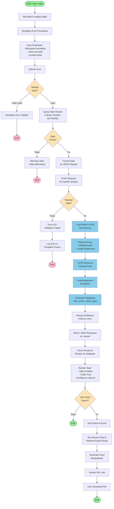
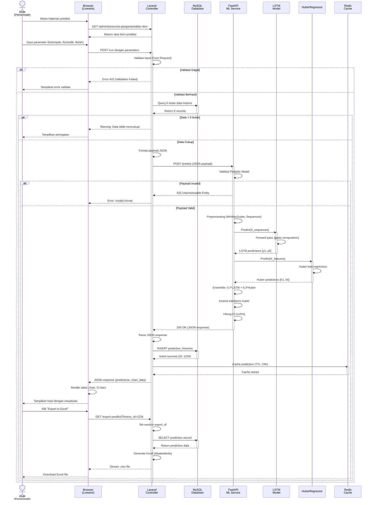

# UML Diagrams untuk Sistem Prediksi NBM

## Activity Diagram - Alur Prediksi Konsumsi Kalori



## Sequence Diagram - Interaksi Sistem Prediksi NBM



## Penjelasan Diagram

### Activity Diagram
Activity diagram menggambarkan alur lengkap proses prediksi konsumsi kalori NBM dari perspektif user workflow:
1. **Input Phase**: User login dan input parameter prediksi
2. **Validation Phase**: Sistem validasi input dan ketersediaan data historis
3. **Prediction Phase**: Integrasi Laravel dengan FastAPI ML service untuk inference
4. **Output Phase**: Rendering hasil prediksi dengan opsi export ke Excel

### Sequence Diagram
Sequence diagram menunjukkan interaksi temporal antar komponen sistem:
1. **User Interface Layer**: Browser (Livewire) sebagai reactive frontend
2. **Application Layer**: Laravel Controller untuk business logic
3. **Data Layer**: MySQL untuk persistence, Redis untuk caching
4. **ML Layer**: FastAPI service dengan LSTM dan HuberRegressor models
5. **Message Flow**: HTTP requests, database queries, dan model inference calls

## Rendering Diagram

### PlantUML (untuk dokumen formal):
```bash
# Install PlantUML
apt-get install plantuml

# Generate PNG
plantuml activity_diagram.puml
plantuml sequence_diagram.puml
```

### Mermaid (untuk GitHub/Markdown):
Diagram Mermaid akan otomatis ter-render di GitHub, GitLab, dan beberapa Markdown viewer modern.

### Online Tools:
- PlantUML Online Editor: https://www.plantuml.com/plantuml/
- Mermaid Live Editor: https://mermaid.live/
